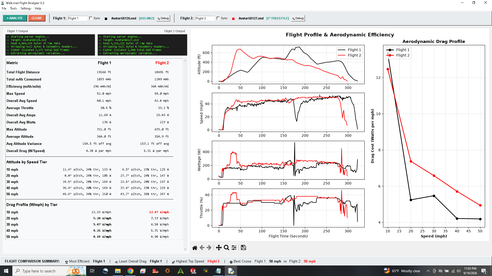

This tool is designed to help you find the differences between two flights using the .osd file that Walksnail Goggles generate with every flight. It is important that your OSD matches the following layout as this version doesn't fully support reading from other OSD layouts. This tool is only tested to work with Betaflight font setting in the goggles menu.

Please setup your Betaflight OSD to match:
-

* These are all on the left margin

* I Find it's easier to start at the bottom and work your way up

*Not all numbered items are on their own row, see notes by each entry

1) Craft Name 

2) Timer 2 

3) GPS Speed

4) Altitude (no decimals)

5) Altitude Vario

6) GPS Satellites

7) Home Direction (next to the GPS Satellites)

8) Link Quality

9) Home Distance

10) Flight Distance

11) Roll Angle 

12) Pitch Angle

13) Flight Mode

14) Rate Profile

15) Throttle Percentage

16) Battery Efficiency

17) mAh Consumed

18) Wattage

19) Amperage

20) Voltage (actually at the bottom)

21) System Messages (next to the Voltage)
